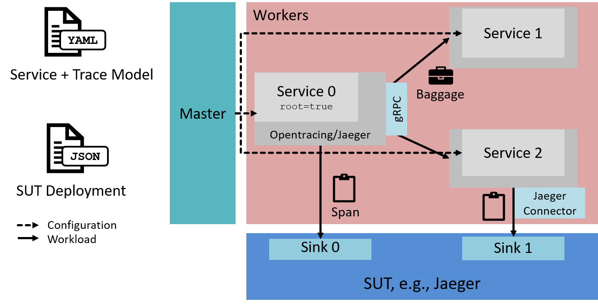

# t-race

Tool to benchmark tracing systems by emulating (possibly complex) multi-service deployments. Implemented as a single executable in Golang.

Inputs for the benchmark are a model of a deployed application (_Service Model_, e.g., `test-2.yaml`), a set of _Workers_ and a set of _Sinks_ (e.g., `deployment_localhost_2.json`). Sinks are the endpoints of the distributed tracing backend.

t-race is under development and considered a prototype. Use at your own discretion.

## Supported SUTs
As of now, t-Race implements an adapter for Jaeger https://www.jaegertracing.io/docs/1.11/. Traces are generated in the OpenTracing https://opentracing.io/ format. Workers communicate using gRPC, which is using HTTP2 for transport, i.e., propagated trace context data is marshalled to HTTP custom headers, check https://github.com/grpc/grpc/blob/master/doc/PROTOCOL-HTTP2.md for some details.

## Overview
t-race follows a master-slave architecture, with the slaves (called *workers*) each emulating a service of an emulated software architecture. Workers without a predecessor are `root`, i.e., they use the configured throughput rate to generate requests. All sucessive workers then are called in an RPC-style fashion. t-race relies on [gRPC](https://grpc.io) streaming to collect of results at the master. See the figure below for the overall architecture of t-race.

## Requirements
Currently I don't provide pre-compiled binaries, that means you need to build t-race yourself. Other than a binary for the OS of your choice, there are no further requirements to running t-race - except, obviously, for a SUT.

### Building
Prerequisites:
* Golang 1.13+ with dep enabled

Simply run `go build .` to download dependencies and create binaries for your local OS.

## Usage

Running a benchmark with t-race consists of five steps, listed below. Please note that t-race does not fully automate all of these steps (and doesn't aim to do so either). The t-race master collects some benchmark results and saves them to *.csv (one for each worker)., including trace and span IDs, span start and finish, as well as a flag, if the trace was sampled (i.e., sent to the SUT).

1. SUT Setup
2. Benchmark Setup
3. Benchmark Execution
4. Result Collection
5. Result Analysis

### SUT Setup (Manual)
As the only currently supported SUT is Jaeger, this means a Jaeger cluster needs to be stood up. Among others, the following decisions need to be made:
* Deployment of endpoints: Jaeger (and other tracing backends) allow the deployment of intermediary endpoints ('agents') to buffer transport to the central backend. These endpoints are referred to as `sinks` in the config of t-race. See the file `deployment_localhost_2.json` for an example with a single sink.
* Sampling and other configuration: Because sampling is configured in the client libraries of tracing systems (including Jaeger), the `t-race worker` command exposes equivalent parameters. Other configurations of the SUT, e.g. which database and database schema should be used, batching of traces during transport, etc. is out of scope for t-race.
* If you want to try out locally first, you can use the provided docker-compose file `docker-compose-jaeger-backend.yml` to setup a local deployment of Jaeger with Cassandra for storage and including Prometheus to collect monitoring data from benchmark workers.

### Benchmark Setup
1. Two types of configurations are needed to execute a benchmark: a deployment configuration (JSON) and a service descriptor file (YAML).
  * Deployment Configuration: check `deployment_localhost_2.json` for an example. This file is needed configure SUT endpoints (`sinks`) and `workers`, which are configured with service and benchmark host:port strings.
  * Service Descriptor: this file describes the architecture of the service deployment to be emulated by deployed workers. Check out the examples `test-2.yaml` and `test-4-multiroot.yaml` for a quick introduction. More information (also about thoughts that went into the concept, design and parameterization of the service descriptor) in its own section. <!--TODO: add ref!-->
2. Start t-race workers on each physical environment where you want to have a service deployed. You can create individual configurations for each worker as a JSON or YAML files, or use command line parameters. If you don't supply any parameters, default values are chose. Use `t-race worker -h` to see available parameteres. Create a deployment file or update `deployment_localhost_2.json` accordingly with entries for each worker under 'workers'.
3. Choose a suitable environment to run the t-race master. Since it does only consume small amounts of CPU and memory, you can opt to use your local machine, which simplifies getting to benchmark results. The master needs to be able to reach all workers on their *benchmarkPort* and maintains a streaming connection to collect benchmark results at runtime.
4. Configure your master with benchmark parameters. See `t-race bench -h` for available parameters. The binary also supports reading a configuration from YAML etc.

### Benchmark Execution
* Start benchmark execution with `t-race bench`. The benchmark master should report receiving result packages in regular intervals.
* When the configured benchmark duration has passed, you can check results of each worker as *.csv files in the results directory.
* Workers keep running after a benchmark, you can re-use them for multiple benchmarks, BUT: be aware that there may be minor side-effects from previous benchmark runs in the SUT (and I'm not entirely confident that there are no side-effects in t-race itself).

### Result Collection
In total, there are three types of data collected during a benchmark run:
* Latency measurements from client side (i.e., workers implemented the SUT client libraries) collected by the benchmark master.
* Traces, stored in the SUT's backend database.
* Monitoring data collected from workers (and possibly the SUT), stored by Prometheus.

The initial goal was to measure latency of traces, in particular:
* **Trace completion time**: time between the first and last spans of a trace being completed
* **Trace visibility delay**: time until read-access of a completed trace is possible (i.e., until it has been written to the database)

The latter was supported by adding instrumentation...TODO?

## Limitations / Roadmap

In the future, we plan to integrate different providers' interfaces, automating the deployment of workers. There is a (very basic) `provider` interface conceptualizing this right now, but only the "static" provider is implemented, which means you need to supply worker IPs etc. through a JSON config file and all workers are assumed to see each other on a local network.

## Links
CQL to CSV export:
https://docs.datastax.com/en/archived/cql/3.3/cql/cql_reference/cqlshCopy.html