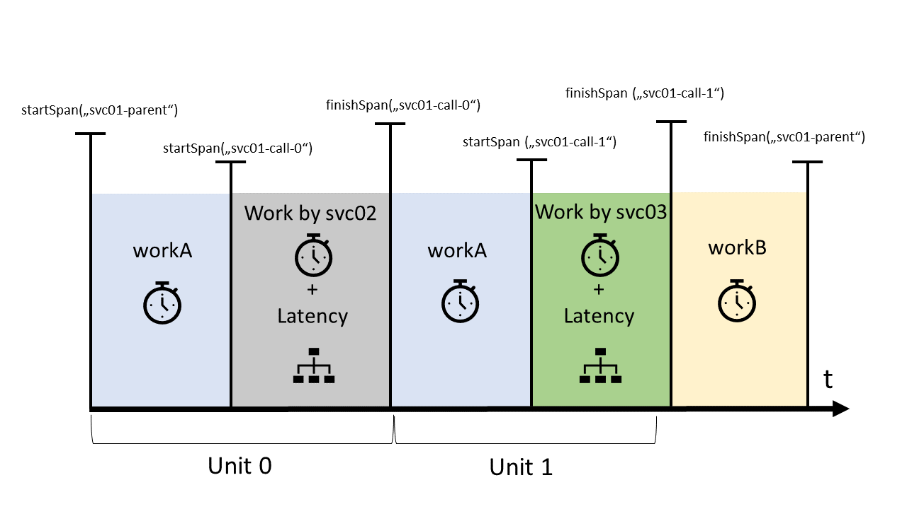

# t-race

Tool to model the observable execution of "microservice-like" architectures. Implemented as a single executable in Golang. Observability systems are t-race's SUT (System under Test).

_Disclaimer: this is a research project - there might be issues and lack of documentation._

t-race's goal is to emulate a deployed application's observable behavior (described by an _architecture_, e.g., `test-2.yaml`), a set of _Workers_ and a set of _Sinks_ (e.g., `deployment_localhost_2.json`). Sinks are the endpoints of an observability backend system. Currently, only distributed tracing systems are supported as the backend.

t-race is under development and considered a prototype. Use at your own discretion.

## Supported SUTs
As of now, t-race implements an adapter for Jaeger https://www.jaegertracing.io/docs/1.11/. Traces are generated in the OpenTracing https://opentracing.io/ format. Workers communicate using gRPC, which is using HTTP2 for transport, i.e., propagated trace context data is marshalled to custom HTTP headers, check https://github.com/grpc/grpc/blob/master/doc/PROTOCOL-HTTP2.md for some details.

## Overview
t-race follows a two-tier architecture with a master, acting as a *coordinator*, and *workers* each emulating a service of an emulated software architecture. Workers are controlled by the coordinator, which connects to workers and assigns a service from the architecture to each. Workers produce requests independently, i.e., they use a globally configured throughput rate and a throughput ratio to generate requests, and/or react to being invoked by other workers. All successive workers, which are not independently producing requests, are called in an RPC-style fashion. t-race relies on [gRPC](https://grpc.io) streaming to collect information about workload generation progress to the master. See the figure below for the overall architecture of t-race.


## Requirements
Currently I don't provide pre-compiled binaries, that means you need to build t-race yourself. Other than a binary for the OS of your choice, there are no further requirements to running t-race - except, obviously, for a SUT.

### Building
Prerequisites:
* Golang 1.13+ with dep enabled

Simply run `go build .` to download dependencies and create binaries for your local OS.

## Usage

Generating workload with t-race consists of five steps, listed below. Please note that t-race does not fully automate all of these steps (and doesn't aim to do so either). The t-race coordinator collects some results about a run and saves them to *.csv (one for each worker)., including trace and span IDs, span start and finish, as well as a flag, if the trace was sampled (i.e., sent to the SUT).

1. SUT Setup
2. Workload Setup
3. Workload Execution
4. Result Collection
5. Result Analysis

### SUT Setup (Manual)
As the only currently supported SUT is Jaeger, this means a Jaeger cluster needs to be stood up. Among others, the following decisions need to be made:
* Deployment of endpoints: Jaeger (and other tracing backends) allow the deployment of intermediary endpoints ('agents') to buffer transport to the central backend. These endpoints are referred to as `sinks` in the config of t-race. See the file `deployment_localhost_2.json` for an example with a single sink.
* Sampling and other configuration: Because sampling is configured in the client libraries of tracing systems (including Jaeger), the `t-race worker` command exposes equivalent parameters. Other configurations of the SUT, e.g. which database and database schema should be used, batching of traces during transport, etc. is out of scope for t-race.
* If you want to try out locally first, you can use the provided docker-compose file `docker-compose-jaeger-backend.yml` to setup a local deployment of Jaeger with Cassandra for storage and including Prometheus to collect monitoring data from workers.

### Workload Setup
1. Two types of configurations are needed to execute a workload: a deployment configuration (JSON) and a service descriptor file (YAML).
  * Deployment Configuration: check `deployment_localhost_2.json` for an example. This file is needed configure SUT endpoints (`sinks`) and `workers`, which are configured with service and workload host:port strings.
  * Service Descriptor: this file describes the architecture of the service deployment to be emulated by deployed workers. Check out the examples `test-2.yaml` and `test-4-multiroot.yaml` for a quick introduction. More information (also about thoughts that went into the concept, design and parameterization of the service descriptor) in its own section. <!--TODO: add ref!-->
2. Start t-race workers on each physical environment where you want to have a service deployed. You can create individual configurations for each worker as a JSON or YAML files, or use command line parameters. If you don't supply any parameters, default values are chose. Use `t-race worker -h` to see available parameteres. Create a deployment file or update `deployment_localhost_2.json` accordingly with entries for each worker under 'workers'.
3. Choose a suitable environment to run the t-race master. Since it does only consume small amounts of CPU and memory, you can opt to use your local machine, which simplifies getting to workload results. The master needs to be able to reach all workers on their *benchmarkPort* and maintains a streaming connection to collect workload results at runtime.
4. Configure your master with workload parameters. See `t-race bench -h` for available parameters. The binary also supports reading a configuration from YAML etc.

### Workload Execution
1. Start workload execution with `t-race bench`. The master should report receiving result packages in regular intervals.
1. When the configured workload duration has passed, you can check results of each worker as *.csv files in the results directory.
1. Workers keep running after a workload, you can re-use them for multiple workload runs, BUT: be aware that there may be minor side-effects from previous workload runs in the SUT (and I'm not 100% confident that there are no side-effects in t-race itself).

### Result Collection
In total, there are three types of data collected during a workload run:
* Latency measurements from client side (i.e., workers implemented the SUT client libraries) - collected by the coordinator.
* Traces, stored in the SUT's backend database.
* Monitoring data collected from workers (and possibly the SUT), stored by Prometheus.

## Concepts
t-race was created with the idea of *monitoring your monitors*. Software is being developed as microservices and deployed into complex, layered virtual environments with a lot of *software infrastructure* (think, e.g., Kubernetes). Monitoring, tracing and logging - in summary observability or telemetry tooling - is an essential part of such software infrastructure. But how well suited exactly are these tools for specific types of analyses, e.g. root cause analysis vs. real-time monitoring? In a running production setting, it does not make sense to evaluate the quality of observability tooling, as this would lead to a second layer of monitoring - to monitor the monitors. As nested monitoring would be incredibly inefficient, I aimed to create a workload generator, which enables reasoning about *choices in deployment and configuaration of observability tooling* in an offline setting.

The fundamental idea behind t-race is consequently to create a repeatable and generic workload for observability tools. As we want to go beyond testing the backend of observability tools (which probably would come down to test the maximum throughput for writing to a database), we need to emulate services generating observability data in a semi-realistic setting. We do so by *emulating service architectures*, which mimic the complexity of actual, large scale deployments.

TODO: the following parts might be incomplete!

### Services and Call Hierachy
The basic unit of the architecture description used as input to a workload is a *service*. Services are an abstraction of a unit of software that has some internal functionality and comprises synchronous and asynchronous calls to other services. Each service is deployed to an *environment* and sends generated traces to a *sink*. The internal functionality of a service is emulated by a delay, which is called *work*. A pair of *work* and a call to another service are each paired into a *unit*.

A service can have multiple *units*, which are executed in order of their appearance. To further illustrate, consider the following example.

```yaml
services:
  - id: svc01
    envRef: env01
    sinkRef: agent1
    units:
      - id: call01A
        work: work01
        ratio: 1.0
        successors: 
          - svc: svc02
            unit: call02A
            sync: true
          - svc: svc02
            unit: call02B
            sync: false
```

### Trace Generation Model
Trace generation can be split into two parts: the generation of hierachically structured spans, constituting traces (see section TODO #ref) and the generation of key-value structured trace context data and baggage (see section TODO #ref).

t-race generates traces by emulating processing, called *work*, and communication between services, which are invoked by *calls*. Work and calls are paired into *execution units*. (see also Section on [[Services and Call Hierarchy]])). Each worker emulates a service, which can have multiple units. Eeach unit executes work and calls a *successor*, though neither is required. Succesors are references to execution units of other services.

Each execution unit has a property called *ratio* (default value 0.0), which determines the rate at which this unit is generating requests, as if users of an application were directly invoking the modeled function of a service. Ratio serves as a multiplier to the target throughput with which the workload is configured.
<!--TODO: finish text and update figure!-->


As shown in this figure, t-race creates a new child span for each remote call, which allows to distinguish between work done locally, emulating some sort of pre-processing, and the duration of the call to the remote service.

Durations for work can be either hardcoded to static values or sampled from different distributions, with currently normal- and exponential distributions being implemented.

Every service generates 

Metadata is in key-value format, with only strings supported for both *tags* and *baggage*. They can be either static values, with strings provided in the architecture description YAML, or random values with given fixed length. Random value trace metadata is generated once during bootstrapping of each worker, i.e. remains constant throughout the course of one benchmark.

## Limitations / Roadmap

DISCLAIMER: t-race will have some bugs and is not always perfectly intuitive to use, since it started as a single-person research endeavor (and also served as a learning experience of golang).

### Roadmap

An automated aggregation of all relevant, trace- and SUT-related data and configurations.

More sophisticated analysis of results (some starting points in the [Jupyter Notebook](analysis.ipynb)) and formalization of benchmarking metrics.

Down the road, I plan to integrate different providers' interfaces, automating the deployment of workers. There is a (very basic) `provider` interface conceptualizing this right now, but only the "static" provider is implemented, which means you need to supply worker IPs etc. through a JSON config file and all workers are assumed to see each other on a local network.

## Useful Stuff / Links
CQL to CSV export:
https://docs.datastax.com/en/archived/cql/3.3/cql/cql_reference/cqlshCopy.html

```
docker run -it --network t-race_tracer-backend -v ${PWD}/results:/results --rm cassandra:3.9 cqlsh cassandra
```
COPY jaeger_v1_dc1.traces TO '/results/traces.csv' WITH HEADER=true;